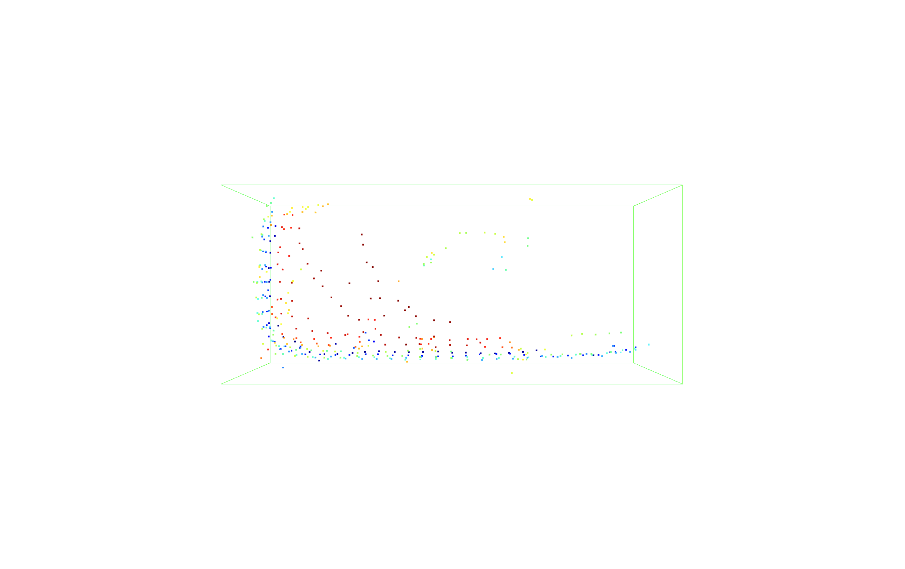

# KITTI 3D Point Cloud Perception Pipeline

This project implements a classical 3D LiDAR point cloud perception pipeline using the KITTI autonomous driving dataset. The pipeline processes raw Velodyne LiDAR point clouds, removes the ground plane, clusters non-ground points, estimates 3D bounding boxes, and generates object-like proposals for autonomous driving scenes.

The goal of this project is to demonstrate practical 3D point cloud processing techniques for perception pipelines, including LiDAR data loading, region-of-interest filtering, voxel downsampling, RANSAC ground removal, DBSCAN clustering, 3D bounding box estimation, and basic heuristic object labeling.

---

## Project Objective

The objective of this project is to process raw KITTI LiDAR point clouds and build a compact classical perception pipeline for autonomous driving use cases.

The pipeline currently supports:

- Loading KITTI `.bin` Velodyne point cloud files
- Converting raw binary LiDAR data into NumPy arrays
- Converting NumPy XYZ coordinates into Open3D point clouds
- Cropping the point cloud to a useful driving region
- Applying voxel downsampling to reduce point density
- Removing the ground plane using RANSAC
- Applying DBSCAN clustering to non-ground points
- Estimating 3D bounding boxes around valid clusters
- Applying simple geometry-based object heuristics
- Saving intermediate point cloud outputs as `.ply` files

---

## Dataset

This project uses the KITTI Object Detection dataset, specifically the Velodyne LiDAR point cloud files.

Each KITTI `.bin` file stores LiDAR points in the following format:

```text
x, y, z, intensity
```

Where:

```text
x = forward distance from the ego vehicle
y = left/right distance from the ego vehicle
z = height
intensity = LiDAR return strength
```

The current implementation was tested on individual KITTI Velodyne frames from the training split.

---

## Current Pipeline

```text
Raw KITTI LiDAR
        ↓
Load .bin file using NumPy
        ↓
Extract XYZ coordinates and intensity
        ↓
Convert XYZ points to Open3D point cloud
        ↓
Region-of-interest cropping
        ↓
Voxel downsampling
        ↓
RANSAC ground plane removal
        ↓
DBSCAN clustering on non-ground points
        ↓
3D bounding box estimation
        ↓
Geometry-based heuristic labeling
        ↓
Object-like detection summary
```

---

## Implemented Features

### 1. KITTI Point Cloud Loader

KITTI Velodyne `.bin` files are raw binary files. Each point contains four `float32` values:

```text
[x, y, z, intensity]
```

The loader reads the file using NumPy:

```python
points = np.fromfile(bin_path, dtype=np.float32).reshape(-1, 4)

points_xyz = points[:, :3]
intensity = points[:, 3]
```

This separates the 3D coordinates from the intensity values.

---

### 2. NumPy to Open3D Conversion

After loading the XYZ coordinates, the NumPy array is converted into an Open3D point cloud:

```python
point_cloud = o3d.geometry.PointCloud()
point_cloud.points = o3d.utility.Vector3dVector(points_xyz)
```

This allows the point cloud to be visualized and processed using Open3D.

---

### 3. Region of Interest Cropping

The raw point cloud contains many points that may not be useful for near-field autonomous driving perception. A region of interest is applied to keep points in front of the ego vehicle and within a reasonable road area.

Default crop settings:

```python
x_range = (0, 70)
y_range = (-40, 40)
z_range = (-3, 3)
```

This keeps:

```text
0 to 70 meters in front of the vehicle
-40 to 40 meters left/right
-3 to 3 meters vertically
```

---

### 4. Voxel Downsampling

Voxel downsampling reduces the number of points while preserving the overall 3D structure of the scene.

Example:

```python
downsampled_cloud = point_cloud.voxel_down_sample(voxel_size=0.15)
```

A voxel size of `0.15` meters was used for the current experiments.

This makes later processing faster and reduces unnecessary point density.

---

### 5. RANSAC Ground Plane Removal

The road surface usually forms the dominant flat plane in a driving scene. RANSAC-based plane segmentation is used to estimate this plane.

```python
plane_model, inliers = point_cloud.segment_plane(
    distance_threshold=0.25,
    ransac_n=3,
    num_iterations=1000
)
```

The detected plane is represented as:

```text
ax + by + cz + d = 0
```

Points close to this plane are treated as ground points. All other points are treated as non-ground points.

For visualization:

```text
Gray = ground points
Red = non-ground points
```

---

### 6. DBSCAN Clustering

After ground removal, DBSCAN clustering is applied to the non-ground point cloud.

DBSCAN was selected because it does not require a fixed number of clusters in advance and can mark sparse points as noise.

The main parameters are:

- `eps`: neighborhood radius in meters
- `min_points`: minimum number of nearby points required to form a cluster

Example:

```python
labels = np.array(
    non_ground_cloud.cluster_dbscan(
        eps=0.6,
        min_points=6,
        print_progress=True
    )
)
```

Several parameter settings were tested during development:

```text
eps = 0.5, min_points = 10
eps = 0.8, min_points = 10
eps = 1.0, min_points = 10
eps = 0.8, min_points = 20
eps = 0.6, min_points = 6
```

The final Day 3 result used:

```text
voxel_size = 0.15
ground_threshold = 0.25
dbscan_eps = 0.6
dbscan_min_points = 6
```

---

### 7. 3D Bounding Box Estimation

After clustering, valid clusters are converted into 3D bounding box proposals using Open3D axis-aligned bounding boxes.

```python
bbox = cluster_cloud.get_axis_aligned_bounding_box()
```

Each bounding box provides:

```text
center position
extent/dimensions
volume
point density
```

Simple geometry filters are applied to remove invalid clusters such as tiny noise, overly large merged structures, flat scan-line artifacts, and sparse clusters.

---

### 8. Heuristic Object Labeling

The current implementation does not train a neural 3D detector. Instead, it applies simple geometry-based heuristics to label object-like clusters.

Example heuristic labels:

```text
vehicle_like
pedestrian_or_pole_like
object_like / unknown
```

A cluster is classified as `vehicle_like` when its bounding box dimensions fall within a rough vehicle-sized range.

---

## Sample Day 1 Result: Ground Removal

Example command:

```bash
python main.py --bin_path data/velodyne/training/velodyne/000010.bin
```

Sample output:

```text
Raw points: 115875
Points after ROI crop: 53552
Points after voxel downsampling: 17396
Detected ground plane equation:
[-0.01004282  0.03282229  0.99941075  1.75464191]
Ground points: 7499
Non-ground points: 9897
```

The detected ground plane equation corresponds approximately to:

```text
-0.010x + 0.033y + 0.999z + 1.755 = 0
```

Since the z coefficient is close to `1.0`, the estimated plane is mostly horizontal, which is consistent with a road surface.

---

## Sample Day 2 Result: DBSCAN Clustering

After removing the ground plane, DBSCAN clustering was applied to the non-ground point cloud. The goal was to group nearby 3D points into object-like clusters that could represent vehicles, pedestrians, poles, signs, trees, or other scene structures.

Sample command:

```bash
python main.py --bin_path data/velodyne/training/velodyne/000010.bin --dbscan_eps 0.8 --dbscan_min_points 10
```

Sample output:

```text
Running DBSCAN clustering on non-ground points...
Precompute neighbors.[========================================] 100%
Detected clusters: 91
Noise points: 869
Visualizing DBSCAN clusters...
Valid clusters after filtering: 1
Cluster 0: 303 points
```

Day 2 showed that clustering raw non-ground LiDAR points is sensitive to preprocessing quality and DBSCAN parameters. Some clusters can appear scattered or merge with scan-line structures, so bounding box filtering is needed before treating clusters as object proposals.

---

## Sample Day 3 Result: 3D Bounding Box Proposal

For frame `002000.bin`, the pipeline produced a valid vehicle-like object proposal.

Command:

```bash
python main.py --bin_path data/velodyne/training/velodyne/002000.bin \
  --voxel_size 0.15 \
  --ground_threshold 0.25 \
  --dbscan_eps 0.6 \
  --dbscan_min_points 6
```

Output:

```text
Raw points: 115181
Points after ROI crop: 59183
Points after voxel downsampling: 20881
Ground points: 11790
Non-ground points: 9091

Running DBSCAN clustering on non-ground points...
Detected clusters: 145
Noise points: 640
Valid clusters after filtering: 1
Cluster 0: 392 points

3D Bounding Box Detection Summary
--------------------------------
Cluster 0 | vehicle_like | points=392 | center=[3.75, 3.14, -0.83] | extent=[3.86, 1.66, 1.11] | density=54.81
```

The detected cluster was classified as `vehicle_like` because its estimated 3D bounding box dimensions were approximately:

```text
length = 3.86 m
width  = 1.66 m
height = 1.11 m
```

These dimensions are consistent with a compact vehicle-like object proposal in a LiDAR point cloud.

### Bounding Box Visualization



---

## Saved Point Cloud Outputs

Intermediate point clouds are saved as `.ply` files using Open3D.

Example:

```python
o3d.io.write_point_cloud(
    "results/non_ground_cloud_002000.ply",
    non_ground_cloud
)

o3d.io.write_point_cloud(
    "results/clustered_cloud_002000.ply",
    clustered_cloud
)
```

Current saved outputs:

```text
results/non_ground_cloud_002000.ply
results/clustered_cloud_002000.ply
```

These files can be reopened later in Open3D, MeshLab, CloudCompare, or other 3D visualization tools.

---

## Repository Structure

```text
kitti-pointcloud-perception/
├── data/
│   └── velodyne/
├── results/
│   ├── bounding_boxes_002000.png
│   ├── non_ground_cloud_002000.ply
│   └── clustered_cloud_002000.ply
├── src/
│   ├── loader.py
│   ├── preprocess.py
│   ├── clustering.py
│   ├── detection.py
│   └── visualize.py
├── main.py
├── requirements.txt
└── README.md
```

---

## File Descriptions

### `src/loader.py`

Handles loading KITTI `.bin` point cloud files.

Main responsibilities:

- Read raw binary LiDAR files
- Reshape data into `[x, y, z, intensity]`
- Separate XYZ coordinates and intensity values
- Convert NumPy arrays into Open3D point clouds

---

### `src/preprocess.py`

Contains preprocessing functions.

Main responsibilities:

- Crop the region of interest
- Apply voxel downsampling
- Remove the ground plane using RANSAC
- Separate ground and non-ground point clouds

---

### `src/clustering.py`

Contains DBSCAN clustering utilities.

Main responsibilities:

- Run DBSCAN clustering on non-ground points
- Assign colors to clusters
- Identify noise points
- Extract valid clusters for bounding box estimation

---

### `src/detection.py`

Contains bounding box and heuristic detection logic.

Main responsibilities:

- Estimate 3D bounding boxes from valid clusters
- Compute bounding box center, extent, volume, and density
- Apply geometry-based filtering
- Assign rough heuristic labels such as `vehicle_like` or `pedestrian_or_pole_like`

---

### `src/visualize.py`

Contains Open3D visualization utilities.

Main responsibilities:

- Visualize raw point clouds
- Visualize cropped point clouds
- Visualize downsampled point clouds
- Visualize ground and non-ground points together
- Visualize DBSCAN clusters
- Visualize clusters with 3D bounding boxes

---

### `main.py`

Runs the full pipeline.

Main steps:

- Load KITTI point cloud
- Visualize raw point cloud
- Crop ROI
- Apply voxel downsampling
- Remove ground plane
- Run DBSCAN clustering
- Extract valid clusters
- Estimate 3D bounding boxes
- Print detection summary
- Save intermediate point clouds

---

## Current Status

Completed components:

- KITTI `.bin` loading
- NumPy parsing
- Open3D point cloud conversion
- Raw point cloud visualization
- ROI cropping
- Voxel downsampling
- RANSAC ground plane removal
- Ground and non-ground point separation
- DBSCAN clustering on non-ground points
- Colored cluster visualization
- Noise point identification
- Cluster count reporting
- Valid cluster extraction
- 3D bounding box estimation
- Geometry-based object proposal filtering
- Heuristic object labeling
- Saving non-ground point cloud as `.ply`
- Saving clustered point cloud as `.ply`

---

## Key Learnings

This project demonstrates that classical LiDAR perception pipelines are highly dependent on preprocessing and parameter tuning.

Important observations:

- Raw LiDAR point clouds contain road surfaces, object points, background structures, and sensor noise.
- ROI cropping reduces irrelevant spatial regions.
- Voxel downsampling reduces point density while preserving overall structure.
- RANSAC ground removal is necessary before clustering because the road surface can dominate the point cloud.
- DBSCAN can group nearby non-ground points, but results depend strongly on `eps`, `min_points`, and preprocessing quality.
- Bounding box estimation helps convert clusters into object-like proposals.
- Geometry filtering is required because DBSCAN can produce merged or background-like clusters.
- The current pipeline performs clustering-based object proposal generation, not trained deep learning-based 3D object detection.

---

## Limitations

This is a classical point cloud processing pipeline and does not train a neural 3D detector.

Current limitations:

- DBSCAN clusters can merge nearby structures or include scan-line artifacts.
- Bounding boxes are axis-aligned, not oriented boxes.
- Heuristic labels are based only on bounding box dimensions.
- The pipeline does not yet compare predictions against KITTI ground-truth labels.
- The current implementation processes recorded LiDAR frames, not live sensor data.
- This project does not reconstruct full 3D object meshes or models.

---

## Planned Next Steps

Planned improvements:

- Compute ego-centric spatial metrics such as object distance and relative position
- Save detection-level outputs as JSON
- Generate a CSV summary across multiple frames
- Add bird’s-eye-view visualization
- Add optional KITTI label comparison for evaluation-lite
- Test the pipeline on more frames and select clean examples
- Add oriented bounding boxes for better object proposal quality

---

## Planned Final Pipeline

```text
Raw KITTI LiDAR
        ↓
ROI Cropping
        ↓
Voxel Downsampling
        ↓
RANSAC Ground Removal
        ↓
DBSCAN Clustering
        ↓
Bounding Box Estimation
        ↓
Spatial Analysis
        ↓
BEV Visualization
```

---

## Skills Demonstrated

This project demonstrates practical experience with:

- 3D LiDAR point cloud processing
- KITTI autonomous driving data
- NumPy binary data parsing
- Open3D point cloud representation
- Region-of-interest filtering
- Voxel downsampling
- RANSAC plane segmentation
- Ground plane removal
- DBSCAN clustering
- 3D bounding box estimation
- Classical object proposal generation
- Autonomous perception pipeline design